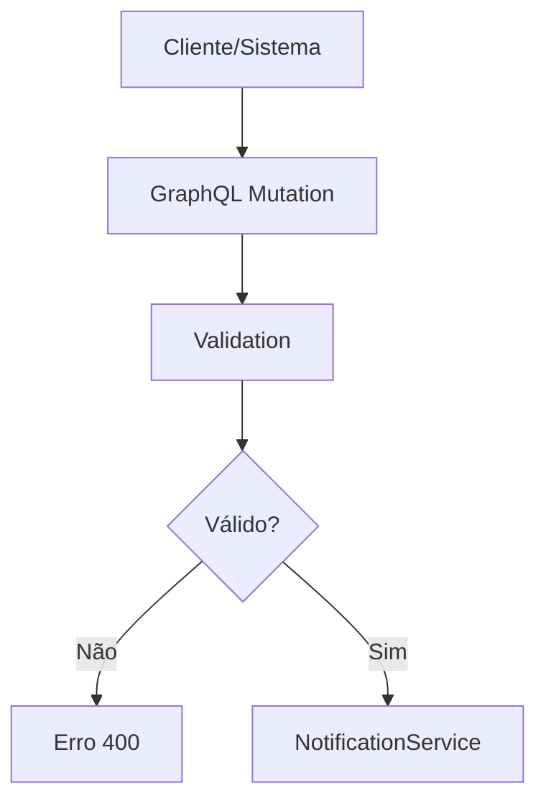
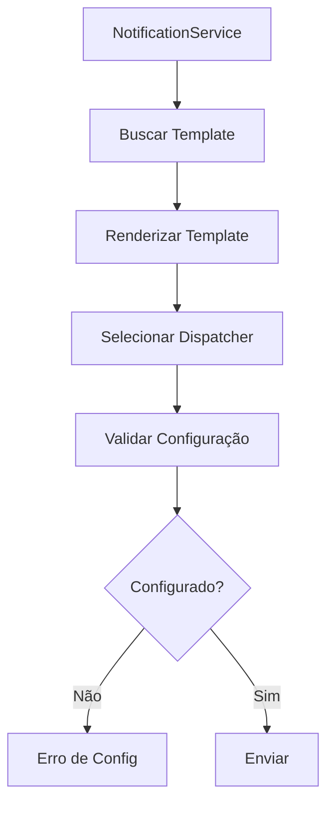
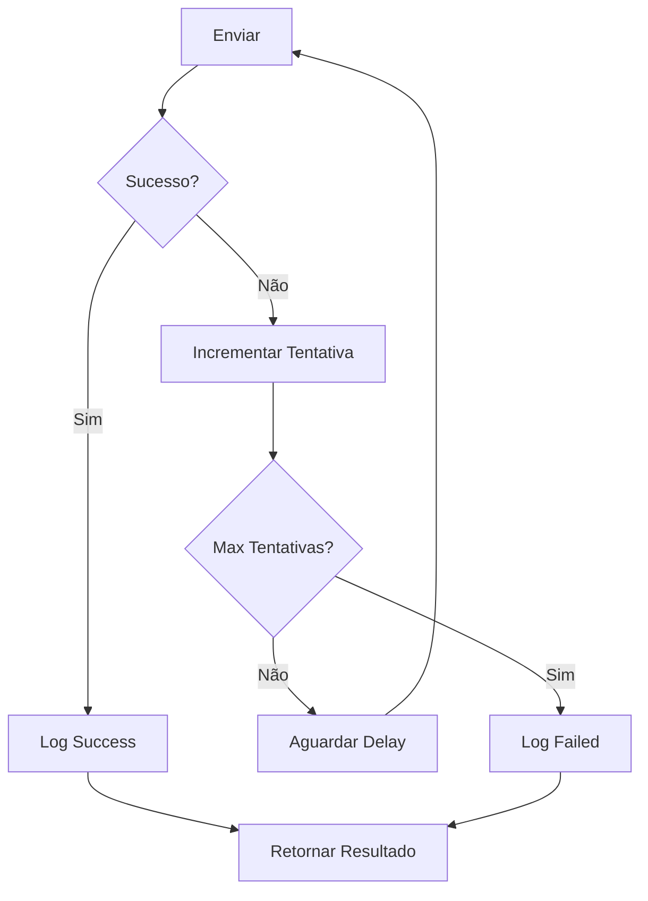

# 📧 Sistema de Notificações - EduMatch

**Versão:** 1.0  
**Data:** Janeiro 2025

---

## 📋 Índice

1. [Visão Geral](#-visão-geral)
2. [Arquitetura do Sistema](#-arquitetura-do-sistema)
3. [Tipos de Notificações](#-tipos-de-notificações)
4. [Canais de Entrega](#-canais-de-entrega)
5. [Templates de Notificação](#-templates-de-notificação)
6. [Fluxo de Envio](#-fluxo-de-envio)
7. [Configuração e Setup](#-configuração-e-setup)
8. [Exemplos Práticos](#-exemplos-práticos)
9. [Monitoramento e Logs](#-monitoramento-e-logs)
10. [Troubleshooting](#-troubleshooting)

---

## 🎯 Visão Geral

O **Sistema de Notificações EduMatch** é uma solução robusta e modular projetada para gerenciar comunicações automáticas com usuários através de múltiplos canais. O sistema suporta desde notificações críticas de segurança até comunicações de marketing, oferecendo flexibilidade, confiabilidade e facilidade de manutenção.

### **Características Principais**

- ✅ **Multi-canal**: Email, Push, Real-time e Third-party
- ✅ **Templates Dinâmicos**: Sistema baseado em LiquidJS
- ✅ **Retry Inteligente**: Reenvio automático em caso de falha
- ✅ **Auditoria Completa**: Logs detalhados de todas as ações
- ✅ **Monitoramento**: Health checks e métricas em tempo real
- ✅ **Categorização**: Organização por domínios de negócio
- ✅ **Escalabilidade**: Arquitetura preparada para alto volume

---

## 🏗️ Arquitetura do Sistema

### **Componentes Principais**

```
┌─────────────────────────────────────────────────────────────┐
│                    NOTIFICATION SYSTEM                      │
├─────────────────────────────────────────────────────────────┤
│                                                             │
│  ┌─────────────────┐    ┌──────────────────────────────┐    │
│  │  GraphQL API    │    │     Template Engine          │    │
│  │  (Resolver)     │───▶│     (LiquidJS)              │    │
│  └─────────────────┘    └──────────────────────────────┘    │
│           │                           │                     │
│           ▼                           ▼                     │
│  ┌─────────────────┐    ┌──────────────────────────────┐    │
│  │ Notification    │    │     Template Service         │    │
│  │ Service         │◄───│     (CRUD + Validation)      │    │
│  └─────────────────┘    └──────────────────────────────┘    │
│           │                                                 │
│           ▼                                                 │
│  ┌─────────────────┐                                        │
│  │ Dispatcher      │                                        │
│  │ Factory         │                                        │
│  └─────────────────┘                                        │
│           │                                                 │
│           ├─── Email (Nodemailer/AWS SES)                   │
│           ├─── Push (FCM/APNs)                              │
│           ├─── Real-time (WebSocket/SSE)                    │
│           └─── Third-party (Webhook/API)                    │
│                                                             │
└─────────────────────────────────────────────────────────────┘
```

### **Fluxo de Dados**

1. **Requisição**: GraphQL Mutation `sendNotification`
2. **Validação**: Verificação de dados de entrada
3. **Template**: Busca e renderização do template
4. **Dispatch**: Seleção do canal e envio
5. **Retry**: Reenvio automático se necessário
6. **Logging**: Registro de sucesso/falha
7. **Resposta**: Retorno do status para o cliente

---

## 📨 Tipos de Notificações

### **Por Categoria de Negócio**

#### **🔐 SISTEMA**

- Manutenções programadas
- Atualizações de sistema
- Avisos técnicos
- Status de serviços

#### **🛡️ AUTH (Autenticação)**

- Verificação de email
- Recuperação de senha
- Alteração de senha
- Login suspeito
- Alteração de dados

#### **🎯 LEADS (Captação)**

- Novos leads
- Follow-up automático
- Nurturing sequences
- Abandono de processo

#### **📈 MARKETING**

- Campanhas promocionais
- Newsletters
- Anúncios de produtos
- Pesquisas de satisfação

#### **⚙️ ADMIN (Administrativo)**

- Relatórios administrativos
- Alertas de sistema
- Notificações de equipe
- Backup/restore status

### **Por Prioridade**

| Prioridade  | Descrição                        | Exemplos                          | Retry Policy            |
| ----------- | -------------------------------- | --------------------------------- | ----------------------- |
| **CRÍTICA** | Falhas de segurança, emergências | Login suspeito, violação de dados | Imediato + 5min + 15min |
| **ALTA**    | Ações importantes do usuário     | Verificação de email, reset senha | 2min + 10min + 30min    |
| **MÉDIA**   | Informações relevantes           | Welcome email, updates            | 5min + 1h + 4h          |
| **BAIXA**   | Marketing, newsletters           | Promoções, pesquisas              | 1h + 6h + 24h           |

---

## 🚀 Canais de Entrega

### **📧 EMAIL**

**Provedores Suportados:**

- **Nodemailer** (SMTP genérico)
- **AWS SES** (Amazon Simple Email Service)

**Configuração:**

```javascript
// Nodemailer
{
  host: process.env.SMTP_HOST,
  port: process.env.SMTP_PORT,
  secure: process.env.SMTP_SECURE === 'true',
  auth: {
    user: process.env.SMTP_USER,
    pass: process.env.SMTP_PASS
  }
}

// AWS SES
{
  accessKeyId: process.env.AWS_ACCESS_KEY_ID,
  secretAccessKey: process.env.AWS_SECRET_ACCESS_KEY,
  region: process.env.AWS_SES_REGION
}
```

**Características:**

- ✅ Confiabilidade alta
- ✅ Suporte a HTML/texto
- ✅ Anexos suportados
- ✅ Tracking disponível
- ⚠️ Pode ter delay
- ⚠️ Limitações de taxa

### **📱 PUSH**

**Provedores Suportados:**

- **FCM** (Firebase Cloud Messaging)
- **APNs** (Apple Push Notification service)

**Características:**

- ✅ Entrega imediata
- ✅ Alta taxa de abertura
- ✅ Ações interativas
- ⚠️ Requer app instalado
- ⚠️ Pode ser desabilitado pelo usuário

### **⚡ REAL-TIME**

**Tecnologias:**

- **WebSocket** para conexões persistentes
- **Server-Sent Events** para updates

**Características:**

- ✅ Instantâneo
- ✅ Bidirecional
- ✅ Ideal para notificações in-app
- ⚠️ Requer conexão ativa
- ⚠️ Limitado ao navegador/app

### **🔗 THIRD-PARTY**

**Integrações:**

- **Webhooks** para sistemas externos
- **APIs REST** para serviços terceiros

**Características:**

- ✅ Flexibilidade total
- ✅ Integração com qualquer sistema
- ⚠️ Depende da disponibilidade externa
- ⚠️ Requer configuração específica

---

## 📝 Templates de Notificação

### **Sistema de Templates**

O sistema utiliza **LiquidJS** como engine de templates, oferecendo:

- **Variáveis dinâmicas**: `{{ user.name }}`
- **Condicionais**: ``
- **Loops**: ``
- **Filtros**: `{{ date | date: '%Y-%m-%d' }}`

### **Templates de Autenticação**

#### **🔐 auth-email-verification**

```liquid
Olá {{ user.name }}!

Para completar seu cadastro no EduMatch, clique no link abaixo:

{{ verificationLink }}

Este link expira em 24 horas.

Caso não tenha solicitado este cadastro, ignore este email.

Atenciosamente,
Equipe EduMatch
```

#### **🔑 auth-password-reset**

```liquid
Olá {{ user.name }}!

Recebemos uma solicitação para redefinir sua senha.

Clique no link abaixo para criar uma nova senha:

{{ resetLink }}

Este link expira em 24 horas.

Se você não solicitou esta alteração, entre em contato conosco imediatamente.

Atenciosamente,
Equipe EduMatch
```

#### **⚠️ auth-login-notification**

```liquid
Olá {{ user.name }}!

Detectamos um novo login em sua conta:

🕐 Data/Hora: {{ loginInfo.timestamp }}
📍 Localização: {{ loginInfo.location }}
💻 Dispositivo: {{ loginInfo.device }}
🌐 IP: {{ loginInfo.ipAddress }}

Se foi você, pode ignorar este email.
Caso contrário, altere sua senha imediatamente.

Atenciosamente,
Equipe EduMatch
```

#### **🔐 auth-password-changed**

```liquid
Olá {{ user.name }}!

Sua senha foi alterada com sucesso em {{ changeInfo.timestamp }}.

📍 Localização: {{ changeInfo.location }}
💻 Dispositivo: {{ changeInfo.device }}

Se você não fez esta alteração, entre em contato conosco IMEDIATAMENTE.

Atenciosamente,
Equipe EduMatch
```

#### **📊 auth-data-changed**

```liquid
Olá {{ user.name }}!

Seus dados foram atualizados:


• {{ change.field }}: {{ change.oldValue }} → {{ change.newValue }}


🕐 Data/Hora: {{ updateInfo.timestamp }}
💻 Dispositivo: {{ updateInfo.device }}

Se você não fez essas alterações, entre em contato conosco.

Atenciosamente,
Equipe EduMatch
```

### **Validação de Templates**

```javascript
// Exemplo de validação
const validationResult = templateRenderer.validateTemplate(content);

if (!validationResult.isValid) {
  throw new Error(`Template inválido: ${validationResult.errors.join(', ')}`);
}
```

---

## 🔄 Fluxo de Envio

### **1. Iniciação**



### **2. Processamento**



### **3. Entrega e Retry**



### **Exemplo de Fluxo Completo**

```typescript
// 1. Requisição GraphQL
mutation {
  sendNotification(input: {
    templateName: "auth-email-verification"
    recipient: {
      email: "user@example.com"
      name: "João Silva"
    }
    data: {
      verificationToken: "abc123..."
    }
  }) {
    status
    externalId
    sentAt
  }
}

// 2. Processamento interno
NotificationService.sendNotification({
  templateName: 'auth-email-verification',
  recipient: { email: 'user@example.com', name: 'João Silva' },
  data: { verificationToken: 'abc123...' }
})

// 3. Resultado
{
  "status": "SENT",
  "externalId": "ses-msg-001",
  "sentAt": "2025-01-06T10:30:00Z"
}
```

---

## ⚙️ Configuração e Setup

### **Variáveis de Ambiente**

```bash
# Email - Nodemailer
SMTP_HOST=smtp.gmail.com
SMTP_PORT=587
SMTP_SECURE=true
SMTP_USER=seu-email@gmail.com
SMTP_PASS=sua-senha-app

# Email - AWS SES
AWS_ACCESS_KEY_ID=AKIA...
AWS_SECRET_ACCESS_KEY=...
AWS_SES_REGION=us-east-1
AWS_SES_FROM_EMAIL=noreply@edumatch.com

# Push - Firebase
FCM_SERVER_KEY=AAAA...
FCM_PROJECT_ID=edumatch-project

# Configurações gerais
NOTIFICATION_RETRY_MAX_ATTEMPTS=3
NOTIFICATION_RETRY_DELAY_MS=60000
NOTIFICATION_DEFAULT_FROM=noreply@edumatch.com
```

### **Configuração de Canais**

```typescript
// src/notifications/config/channels.config.ts
export const channelsConfig = {
  email: {
    primary: 'aws-ses', // ou 'nodemailer'
    fallback: 'nodemailer',
    retryPolicy: {
      maxAttempts: 3,
      delays: [60000, 300000, 900000], // 1min, 5min, 15min
    },
  },
  push: {
    primary: 'fcm',
    retryPolicy: {
      maxAttempts: 2,
      delays: [30000, 120000], // 30s, 2min
    },
  },
};
```

---

## 💡 Exemplos Práticos

### **Envio de Email de Verificação**

```typescript
// No AuthenticationService
async register(data: RegisterDto) {
  const user = await this.createUser(data);

  // Envio automático de verificação
  await this.emailVerificationService.sendVerificationEmail(
    user.id,
    user.email,
    user.username
  );

  return user;
}

// No EmailVerificationService
async sendVerificationEmail(userId: string, email: string, name: string) {
  const token = this.generateSecureToken();
  const verificationLink = `${frontendUrl}/verify-email?token=${token}`;

  return this.notificationService.sendNotification({
    templateName: 'auth-email-verification',
    recipient: { email, name },
    data: { verificationLink, token }
  });
}
```

### **Notificação de Login Suspeito**

```typescript
// No SecurityNotificationService
async sendLoginNotification(user, loginInfo) {
  return this.notificationService.sendNotification({
    templateName: 'auth-login-notification',
    recipient: {
      email: user.email,
      name: user.username
    },
    data: {
      loginInfo: {
        timestamp: new Date().toISOString(),
        location: loginInfo.location || 'Não disponível',
        device: loginInfo.device || 'Navegador',
        ipAddress: loginInfo.ipAddress
      }
    }
  });
}
```

### **Recuperação de Senha**

```typescript
// No PasswordResetService
async forgotPassword(email: string) {
  const user = await this.findUserByEmail(email);

  if (user) {
    const token = this.generateSecureToken();
    const resetLink = `${frontendUrl}/reset-password?token=${token}`;

    await this.notificationService.sendNotification({
      templateName: 'auth-password-reset',
      recipient: { email: user.email, name: user.username },
      data: { resetLink, token }
    });
  }

  // Sempre retorna sucesso (segurança)
  return { success: true };
}
```

---

## 📊 Monitoramento e Logs

### **Health Check**

```graphql
query {
  getChannelsHealthStatus {
    channel
    provider
    isHealthy
    isConfigured
    timeout
  }
}
```

**Exemplo de Resposta:**

```json
[
  {
    "channel": "email",
    "provider": "aws-ses",
    "isHealthy": true,
    "isConfigured": true,
    "timeout": 5000
  },
  {
    "channel": "push",
    "provider": "fcm",
    "isHealthy": false,
    "isConfigured": true,
    "timeout": 3000
  }
]
```

### **Estatísticas de Retry**

```graphql
query {
  getRetryStatistics {
    pending
    retrying
    success
    failed
    total
  }
}
```

### **Logs Estruturados**

```json
{
  "timestamp": "2025-01-06T10:30:00Z",
  "level": "info",
  "message": "Notification sent successfully",
  "context": "NotificationService",
  "data": {
    "templateName": "auth-email-verification",
    "recipient": "user@example.com",
    "channel": "email",
    "provider": "aws-ses",
    "externalId": "ses-msg-001",
    "attempt": 1,
    "responseTime": 1250
  }
}
```

---

## 🔧 Troubleshooting

### **Problemas Comuns**

#### **📧 Email não está sendo enviado**

**Possíveis Causas:**

- Configuração SMTP incorreta
- Credenciais AWS SES inválidas
- Email em lista de spam
- Rate limiting ativo

**Soluções:**

1. Verificar variáveis de ambiente
2. Testar conexão SMTP
3. Validar configuração AWS SES
4. Verificar logs de erro

```bash
# Testar configuração
curl -X POST http://localhost:3000/graphql \
  -H "Content-Type: application/json" \
  -d '{
    "query": "query { getChannelsHealthStatus { channel isHealthy } }"
  }'
```

#### **🔄 Rate Limiting muito restritivo**

**Sintomas:**

- Muitas requisições rejeitadas
- Status 429 frequente

**Soluções:**

1. Ajustar limites nas configurações
2. Implementar queue de notificações
3. Distribuir envios ao longo do tempo

#### **📝 Template renderização falha**

**Sintomas:**

- Erros de sintaxe LiquidJS
- Variáveis não substituídas

**Soluções:**

1. Validar sintaxe do template
2. Verificar dados fornecidos
3. Usar preview para testar

```graphql
# Testar template
query {
  validateTemplateContent(content: "Olá {{ user.name }}!")
}

# Preview com dados
query {
  previewNotificationTemplate(
    templateName: "auth-email-verification"
    sampleData: "{\"user\":{\"name\":\"João\"}}"
  )
}
```

### **Debugging**

```typescript
// Habilitar logs debug
export const debugConfig = {
  logLevel: 'debug',
  logRequests: true,
  logResponses: true,
  logRetries: true,
};

// Exemplo de log debug
this.logger.debug('Rendering template', {
  templateName,
  variables: Object.keys(data),
  recipientEmail: recipient.email,
});
```

---

## 📚 Referências

- **LiquidJS Documentation**: [liquidjs.com](https://liquidjs.com)
- **AWS SES Documentation**: [docs.aws.amazon.com/ses](https://docs.aws.amazon.com/ses/)
- **Nodemailer Documentation**: [nodemailer.com](https://nodemailer.com)
- **GraphQL Specification**: [spec.graphql.org](https://spec.graphql.org)

---

**📧 Sistema de Notificações EduMatch - Documentação Completa**  
_Última atualização: 06/01/2025_
